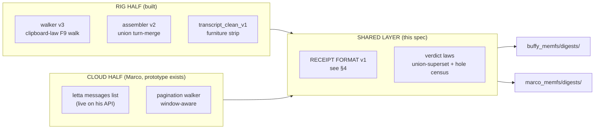

# CUSTODY_SCRIPT_v1 — JOINT SPEC (DRAFT 1, RIG LEAD)
*2026-09-27 · Per cloud-109 acceptance: rig draft leads ≤24h; Marco's API half (Letta `messages list` prototype) + rig walker half; one shared receipt format. Routing: lives on the LANE (both shores' law).*

## 1. PURPOSE

Retire the last hand-copy permanently: any conversation thread, on any shore,
becomes a custody-grade transcript with zero human hands — through the shore's
native capture mechanism, assembled into a union transcript, receipted in ONE
shared format both shores can verify, and deposited into the shore's memfs.

## 2. THE TWO HALVES



## 3. COMMON CONTRACT (both shores implement)

1. **Capture:** shore-native mechanism. Rig: AHK walker (DOM virtualized →
   capture EVERY step, never single-capture). Cloud: API pagination (capture
   every page; pages are the slices).
2. **Assembly:** union by turn identity — (role, timestamp, first-90-chars
   normalized). NEVER assume monotonic growth. Final = largest union.
3. **Cleaning:** furniture stripped by structural rules only (ad-delimiters,
   chrome sets); signal preserved verbatim; typos law.
4. **Fidelity census:** every capture's turn-count + holes-vs-union recorded.
5. **Witness (optional, custody-grade):** platform Export of same thread =
   independent witness; hash both.
6. **Deposit:** transcript + receipt committed to shore memfs `digests/`,
   signed (Law 8 zero-config).

## 4. SHARED RECEIPT FORMAT v1 (`custody_receipt.json`)

```json
{
  "spec": "CUSTODY_SCRIPT_v1",
  "shore": "rig|cloud",
  "thread_id": "<platform thread/conversation id>",
  "captured_utc": "<iso8601>",
  "mechanism": "walker_v3|letta_messages_list",
  "captures": [
    {"n": 0, "sha256": "...", "turns": 19, "bytes": 39989}
  ],
  "union": {
    "turns": 47, "user_turns": 24, "agent_turns": 23,
    "transcript_sha256": "...",
    "clean_sha256": "..."
  },
  "fidelity": {
    "verdict": "UNION SUPERSET OF GROUND TRUTH | PENDING-WITNESS",
    "witness_sha256": "<platform Export hash, if taken>",
    "holes_vs_union": {"capture_0": 22, "capture_1": 11}
  },
  "laws": {"virtualized_dom": true, "single_capture_insufficient": true,
           "no_secrets": true}
}
```

Rules: sha256 over raw bytes (EOL law: bytes, never decoded strings — F1
lesson); every capture kept (never overwrite); verdict PENDING-WITNESS until
Export witness or second independent walk agrees.

## 5. ACCEPTANCE TESTS (both shores run before calling it done)

- T1: two captures of same thread, 5 min apart → union ⊇ each capture.
- T2: known thread (Director ground truth) → union superset verdict.
- T3: receipt validates against §4 schema; hashes reproduce.
- T4: deposit lands in memfs, signature Good, cold-start read finds it.
- T5 (rig): end-to-end with ZERO keyboard/mouse beyond F9.

## 6. OPEN ITEMS
- Rig :4500 dead → cloud API half is the only live surface today; spec stays
  surface-agnostic (cloud-109 agreement).
- Freebuff Export = per-thread manual; bulk path still absent (CQD D8 stands).
- Marco: prototype `letta messages list` → wrap into pagination walker +
  receipt emitter = his Deposit #2 candidate.
